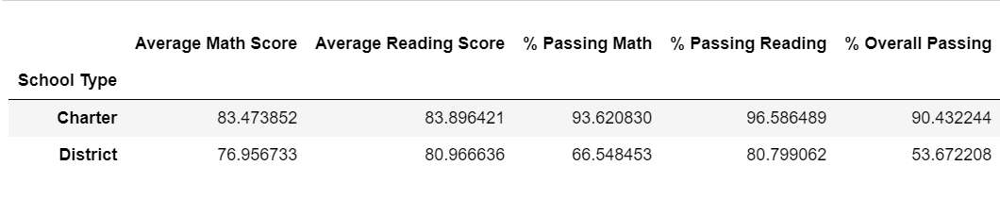

# School District Analysis
## Project Overview
In the school district analysis, we analyzed school performance based on standardized test scores and tried to pinpoint the factors that lead to higher test performance. We used two CSV files containing the student data and school data, along with the pandas module in python, to discern each school's attributes. We then used those attributes to create performance indicators that the school board can use to address struggling schools and allocate resources to improve testing performance. After our initial analysis, we were notified that the test scores for 9th-grade students attending Thomas High School were compromised. We adjusted our analysis to reflect the new information and to ensure an accurate analysis of the school district in question. By manipulating CSV data in data frames, we will determine vital metrics, such as how school size affects standardized test scores. 
## Resources
- Data Source: schools_complete.csv, students_complete.csv
- Software: Python 3.7.6, Jupyter Notebook
## Results
### Original District Summary Data Frame:

### New District Summary Data Frame:

- Effect on district summary
  - The average math score decreased by 0.1
  - The percent of students passing math decreased by 0.2%
  - The percent of students passing reading decreased by 0.3%
  - The overall passing percent decreased by 0.1%

### Original School Summary Data Frame:

### New School Summary Data Frame: 

- Effect on school summary
  - The average math score for Thomas High School decreased by 0.07, while the average reading score increased by 0.05

- How does replacing the ninth graders’ math and reading scores affect Thomas High School’s performance relative to the other schools?
  - The percentage of students passing math, reading, and the overall percentage decreases by roughly a third. For example, the new overall passing percentage for Thomas High School is now 65% compared to 91% in the initial analysis that included ninth-grade scores. Replacing the ninth-grade scores with null values gives us the impression that Thomas High School is not a high-performing school compared to other high schools. Before we excluded ninth-grade students from the analysis, Thomas High School was one of the top five schools based on the overall passing percentage
  - Original top 5 with ninth graders includes:
    - 
  - If we adjust the top 5 schools to include only the data from 10th-12th grades, Thomas High Schools still remains in the top 5.
    - 

- Math and reading scores by grade
  - The math and reading score by grades data frames contained "nan" for ninth graders from Thomas High School.
- Scores by school spending
  - The original and adjusted data frames contained the same information after rounding to the district standard. 
- Scores by school size
  - The original and adjusted data frames contained the same information after rounding to the district standard.
- Scores by school type
  - The original and adjusted data frames contained the same information after rounding to the district standard. Changes in values before formatting were negligible.
  - Original: 
      - 
  - Adjusted: 
      - 

## Summary

